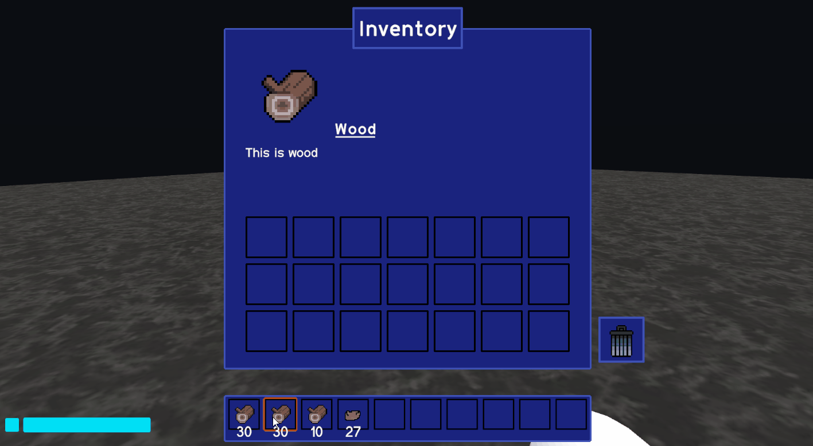

<!-- Project Information -->

  <h1>Inventory System:</h1>
  <h3>🎮Game Description:</h3>
  <h4>This was a personal project in which I developed a simple inventory system for a 3D scene. The player is able to pickup objects in game and sort them within their inventory/hotbar using the mouse and keyboard shortcuts.</h4>
  <h3>⭐Project Summary:</h3>
  <ul>
    <li>Team: Solo
    <li>Duration: 2 weeks
    <li>Language: C#
    <li>Engine: Unity (Version: 2020.3.38f1)
  </ul>

<!-- Project Image/Gif -->

  

